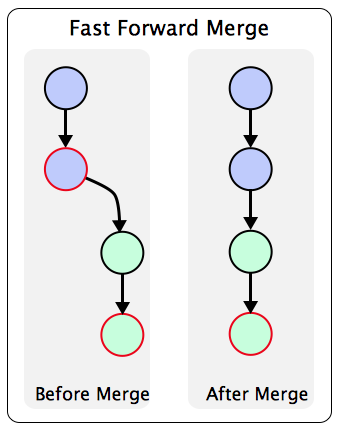

# GitHub Branching and Merging Strategy

## Introduction
GitHub is a [developer platform](https://github.com/features) built on top of the [Git version control system](https://git-scm.com/).

Git has an unparalleled set of features with flexibility beyond our wildest dreams, but in the words of the wise Uncle Ben:


To use Git optimally, a team of developers must agree on a common workflow or strategy of branching and merging. This document proposes one such strategy.

## Git vs. GitHub: what's the difference?

[GutHib](https://guthib.com/) differs from "classic" Git in some ways that seem small but have consequences of galactic proportions. 

For most purposes, the differences are most significant when merging GitHub pull requests.

### What is a fast-forward merge?
A common development workflow is to branch off of a branch A to work on a task in branch B. Then when branch B is ready, it is merged back into branch A. [Fast-forward merge](https://git-scm.com/docs/git-merge#_fast_forward_merge) is an innovative Git feature where, instead of creating a new merge commit to store the combined history, Git will simply update the HEAD of branch A (along with the index) to point at branch B's HEAD commit.



[Image source](https://www.bogotobogo.com/DevOps/SCM/Git/Git_GitHub_Fast-Forward_Merge.php)

This is in the majority of cases what you want to happen, and so classic Git smartly uses fast-forward merging whenever possible, by default, unless you specify otherwise with the `--no-ff` flag.

Surprisingly and unfortunately, [GitHub does not support](https://stackoverflow.com/questions/60597400/how-to-do-a-fast-forward-merge-on-github) fast-forward merges when merging pull requests using the GitHub UI (or GitHub CLI). This means that any time a pull request (PR) is merged, there will be an extra merge commit in the history, even if the base branch's HEAD is an ancestor of your PR's branch. While seemingly small, these extra merge commits add up to make the Git log convoluted and confusing.

GitHub provides an alternative solution to this problem in the form of the "Rebase and Merge" method, but it is a poor substitute. More on this below.

## What are the different ways to merge pull requests on GitHub?
GitHub provides the following 3 methods for merging pull requests.

### Standard merge
Same as classic Git's [true merge](https://git-scm.com/docs/git-merge#_true_merge).


### Squash and merge
Squashes all commits in your branch into one before true-merging into the base branch.


### Rebase and merge
Similar to [git-rebase](https://git-scm.com/book/en/v2/Git-Branching-Rebasing), but without the ingenuity of fast-forward behavior. Rewrites each commit in your task branch as a new commit in the base branch with you as the author, even if the commit was created by someone else.

Sorry, no diagram here, or even on [GitHub's official documentation](https://docs.github.com/en/pull-requests/collaborating-with-pull-requests/incorporating-changes-from-a-pull-request/about-pull-request-merges#rebase-and-merge-your-pull-request-commits). Rebasing is described quite well [in the official Git documentation](https://git-scm.com/book/en/v2/Git-Branching-Rebasing), but GitHub's Rebase and Merge is not the same unfortunately.

## So what's the right way to merge GitHub pull requests?

The only way to reap the bounties of fast-forward merges and classic rebasing is to use Git exclusively on the command line, and to **NEVER, EVER** use GitHub UI or GitHub CLI for Git operations. More on this below.

## Git Workflow for Teams

### I have a new development task to do. Which branch should I work in?
Create and work in a new branch for your new task, based off your team's preferred upstream branch (master, development, etc.).

1. Switch to the upstream branch:
```
$ git checkout master
```

2. Pull the latest commits on the master branch:
```
$ git pull origin master
```

3. Create a new branch and switch to the branch:
```
$ git branch <task-name>
$ git checkout <task-name>
```

### My pull request on GitHub has been approved. How do I merge with the upstream branch?

**Do everything in your terminal using classic Git commands. DO NOT use GitHub UI or GitHub CLI.**

1. Pull the upstream branch to get any commits made on it after you branched off from it:
```
$ git checkout master
$ git pull origin master
```

2. Rebase your task branch onto the upstream branch:
```
$ git checkout <task-name>
$ git rebase master
```

#### Before rebase


#### After rebase


All your new commits on your task branch will be applied onto the upstream branch, while preserving all commits and authors. It will be as if you had developed on the upstream branch all along. There will be no extra merge commits, and history will be beautifully linear. If there are merge conflicts, Git will ask you to manually resolve them; once you are done resolving the conflicts, continue the rebase operation with `git rebase --continue`.

3. Merge your task branch into the upstream branch:
```
$ git checkout master
$ git merge <task-name>
```

This will be a fast-forward merge, since upstream is now an ancestor of your rebased task branch.

#### After fast-forward merge


4. Finally, push the upstream branch:
```
$ git push origin master
```

### What if multiple developers are working on a task? How should they share a task branch?
There should be a single branch per task and each developer working on that branch should in turn create their own branch from the shared task branch. In this manner, the Git workflow described above can be applied recursively as many times as needed.

### I had to make a hotfix on an upstream branch directly. How do I merge the hotfix to downstream branches?
Merging downstream is one of the rare cases when you actually want to keep merge commits in your history. Use plain old git merge for this purpose:

1. Checkout downstream branch:
```
$ git checkout development
```

2. Merge upstream branch:
```
$ git merge master 
```

This will be a true merge, and an extra merge commit will be created. View a graph of the commit history with `git log --graph`.

3. Push downstream branch:
```
$ git push origin development
```

### When is it better to merge rather than rebase and thereby keep merge commits in my history?
One common case is when you have to merge a hotfix downstream (see above).

Another case is if you are working on a branch for a long time, and the branch has diverged "significantly" from its upstream branch.
